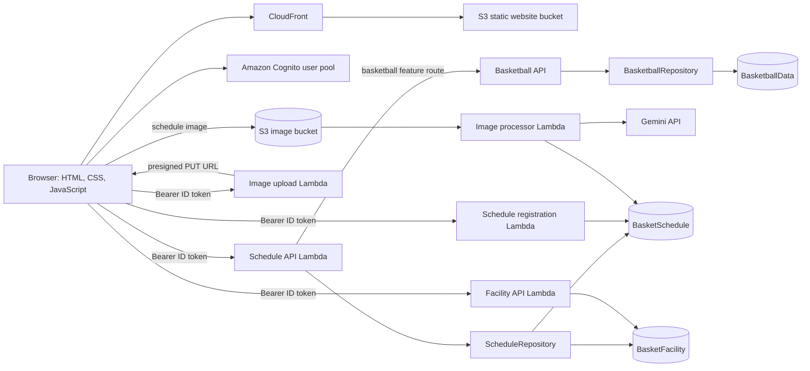

# Flight Penguins Official Site architecture

This document describes the current implementation. It records behavior visible in the source and names the AWS resources used by the handlers.

## Runtime components

## Request paths

| User action                                        | Browser entry point                       | AWS handler                                                                         | Data store                               |
| -------------------------------------------------- | ----------------------------------------- | ----------------------------------------------------------------------------------- | ---------------------------------------- |
| Read schedules and schedule details                | `app.js`                                  | `ScheduleApi` (`basket-schedule-get`)                                               | `BasketSchedule`, `BasketFacility`       |
| Render and manage announcements                    | `announcement-controller.js` and `app.js` | `ScheduleApi` → `AnnouncementService`                                               | `BasketSchedule`                         |
| Create or update schedules                         | `register.js` and `app.js`                | `ScheduleRegisterApi` / `ScheduleApi`                                               | `BasketSchedule`                         |
| Read or create facilities                          | `app.js` and `register.js`                | `FacilityApi`                                                                       | `BasketFacility`                         |
| Request image upload URL and poll processing state | `register.js`, `image-jobs.js`            | `UploadApi`                                                                         | S3 object tags for processing state      |
| Extract events from an uploaded image              | S3 object-created event                   | `ImageProcessor`                                                                    | `BasketSchedule` after Gemini extraction |
| Manage rosters, games, score actions, and rankings | `basketball.js`                           | `BasketballApi`, routed by `ScheduleApi`; records go through `BasketballRepository` | `BasketballData`                         |
| Manage Cognito users and roles                     | `members.js` / `account-menu.js`          | `BasketballApi` → `CognitoUserAdminService`                                         | Cognito user pool                        |

`buildspec.yml` builds the Java artifact, updates the configured Lambda functions, synchronizes static files to S3, and invalidates CloudFront. A push to a connected pipeline branch can therefore deploy application changes.

## Stored records

The schedule table uses `scheduleMonth` and `startDateTime` as its key attributes for event records. Announcement records are separated with `recordType=ANNOUNCEMENT` and use an announcement partition and ID.

The facility table stores enabled facilities, their address, optional public URL, optional note, and ordering metadata. The event record references a facility ID; the API joins the current facility fields when producing schedule details.

Basketball records use `pk` and `sk`. Teams and team rosters are grouped under team keys. Games store the IDs of their expected participants; game and per-player statistics use game and season partitions so the scorebook can list games, calculate rankings, exclude DNP players from appearance averages, and show player trends. User identity and groups remain in Cognito; the Lambda execution role performs permitted account-management operations.

## Processing an image

1. An administrator asks `UploadApi` for a short-lived presigned S3 upload URL.
2. The browser uploads the image directly to S3 and receives a job identifier.
3. S3 invokes `ImageProcessor` for the new object.
4. The processor sends the image and extraction instructions to Gemini.
5. The processor validates and writes the extracted schedule entries and updates processing tags on the image.
6. The browser polls job status and displays progress or a dismissible error.

The image processor's Gemini API key is read from the Lambda environment as `GEMINI_API_KEY`.
