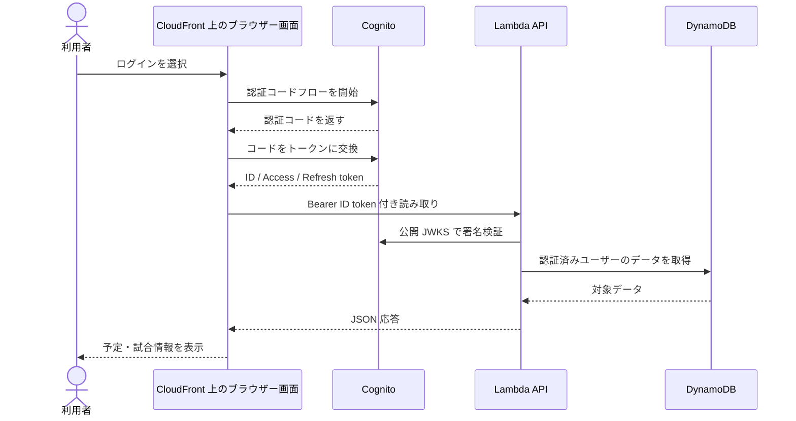
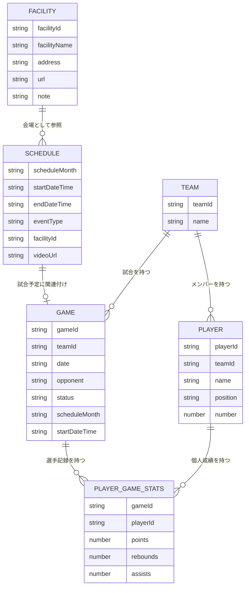

# 外部設計書

## 1. システム概要

COURTSIDE は、バスケットボールチームの予定、施設、周知事項、練習動画、チーム名簿、試合結果をブラウザーから管理・閲覧する Web アプリケーションです。フロントエンドは静的ファイルとして配信し、データ操作は Java の AWS Lambda API を通じて行います。

## 2. 利用者と権限

| 利用者                      | 閲覧                                                                 | 登録・編集・削除                                                   |
| --------------------------- | -------------------------------------------------------------------- | ------------------------------------------------------------------ |
| ゲスト（Cognito 認証済み）  | 予定、施設、公開中のお知らせ、チーム、メンバー、試合結果、ランキング | 不可                                                               |
| 管理者（`admins` グループ） | ゲストと同じ                                                         | 予定、施設、お知らせ、動画リンク、チーム、メンバー、試合、スタッツ |

画面上の表示制御は操作を分かりやすくするためのものです。書き込み API は Cognito の署名済み ID トークンを検証し、`admins` グループをサーバー側でも確認します。

## 3. 画面一覧

| 画面               | URL                             | 主な機能                                                           |
| ------------------ | ------------------------------- | ------------------------------------------------------------------ |
| ログイン・予定表   | `index.html`                    | 月カレンダー、今日・今週の予定、お知らせ、動画、予定詳細、ICS 出力 |
| 予定登録           | `register.html?screen=schedule` | 手入力、画像アップロード、画像解析ジョブの状態確認                 |
| 施設登録           | `register.html?screen=facility` | 施設名、住所、URL、備考の登録                                      |
| チーム             | `basketball.html?view=teams`    | チームとメンバーの管理                                             |
| 試合               | `basketball.html?view=games`    | 試合作成、試合一覧、スコア記録・編集                               |
| ランキング         | `basketball.html?view=rankings` | シーズン別スタッツと選手推移                                       |
| アカウントメニュー | 各認証済み画面                  | ロール表示、ログアウト、Cognito アカウント削除                     |

画面間の移動は共通ナビゲーションに集約します。現在地は `aria-current="page"` で示し、予定表のセクションリンクはスクロール位置に合わせて更新します。

## 4. 主要な処理

### 4.1 ログインと閲覧

1. ブラウザーから Cognito マネージドログインを開きます。
2. 認証コードを受け取り、フロントエンドが ID トークンとアクセストークンを取得します。
3. 認証済み利用者は API に Bearer ID トークンを付けて読み取りを行います。
4. 管理者でない場合、登録・編集導線を隠し、登録画面への直接アクセスも拒否します。

### 4.2 予定画像の登録

1. 管理者が画像アップロード API から期限付き S3 PUT URL を取得します。
2. ブラウザーが画像を S3 に直接アップロードします。
3. S3 イベントが画像処理 Lambda を起動します。
4. Lambda が Gemini に画像を送り、抽出したイベントを検証して DynamoDB に保存します。
5. ブラウザーは S3 オブジェクトの処理状態を定期確認し、完了または失敗を表示します。

### 4.3 試合とスタッツ

1. 管理者がチームとメンバーを登録します。
2. 試合を作成し、必要なら予定表上の試合予定と関連付けます。
3. 試合中にコート上の選手を選択し、得点・リバウンド等のアクションを記録します。
4. API が試合状態を DynamoDB に保存し、一覧・ランキング・個人推移に反映します。

## 5. 外部インターフェース

| 接続先                       | 用途                                         | 認証・通信                            |
| ---------------------------- | -------------------------------------------- | ------------------------------------- |
| Amazon Cognito               | サインイン、トークン発行、自己アカウント削除 | OAuth 認証コードフロー、HTTPS         |
| Amazon CloudFront / S3       | 静的画面配信                                 | HTTPS                                 |
| AWS Lambda Function URL      | 予定、施設、チーム、試合の API               | HTTPS、Bearer ID トークン、CORS       |
| Amazon DynamoDB              | 予定・施設・バスケットボールデータ           | Lambda 実行ロール                     |
| Amazon S3                    | 予定画像と処理状態                           | 期限付きアップロード URL、S3 イベント |
| Gemini API                   | 予定画像の読み取り                           | Lambda 環境変数の API キー            |
| YouTube                      | 練習動画の再生                               | 限定公開 URL を予定データに保存       |
| Google Calendar / Outlook 等 | 月単位の予定取り込み                         | ブラウザーで ICS ファイルを書き出し   |

## 6. データの主要概念

- **予定**: 開始・終了日時、種別、施設、任意の大会名・ラウンド・動画 URL を持ちます。
- **施設**: 名前、住所、URL、備考、表示状態を持ちます。
- **お知らせ**: 見出し、本文、緊急度、有効期限を持ちます。
- **チーム／メンバー**: チームにメンバーを紐付け、ポジション・背番号等を管理します。
- **試合／スタッツ**: 試合情報と選手ごとのプレー記録を保持し、ランキング値を集計します。
- **画像処理ジョブ**: S3 オブジェクトキーを識別子として状態・エラー概要を参照します。

DynamoDB の正確なキー名、インデックス、保持期間は実環境のテーブル定義を正とします。データモデルを変更する場合は `docs/architecture.md` とこの設計書も一緒に更新してください。

この図は業務上の関連を表します。現在の実装では DynamoDB の複数テーブル／キーに分かれて保存されるため、物理構造を示すものではありません。

## 7. 非機能要件と制約

- 通信は HTTPS を使用します。
- 認証トークン、個人情報、秘密鍵をログに出力しません。
- ブラウザーの権限判定だけで API 操作を許可しません。
- ファイルアップロードは署名付き URL を利用し、Lambda を経由してファイル本体を転送しません。
- 動画は外部 URL を保存し、動画本体を本システムで保管しません。
- ICS は月ごとの手動取り込みで、Google Calendar との自動同期は行いません。

## 8. 運用と変更の影響範囲

画面項目や導線の変更は `src/main/resources/static/` と本設計書を更新します。API の認可やデータ形状を変える場合は Java Lambda、フロントエンド API 呼び出し、権限テスト、AWS IAM 設定、アーキテクチャ資料を同時に確認します。デプロイは Git の接続ブランチへの push を契機に CodePipeline / CodeBuild が実行する構成です。
