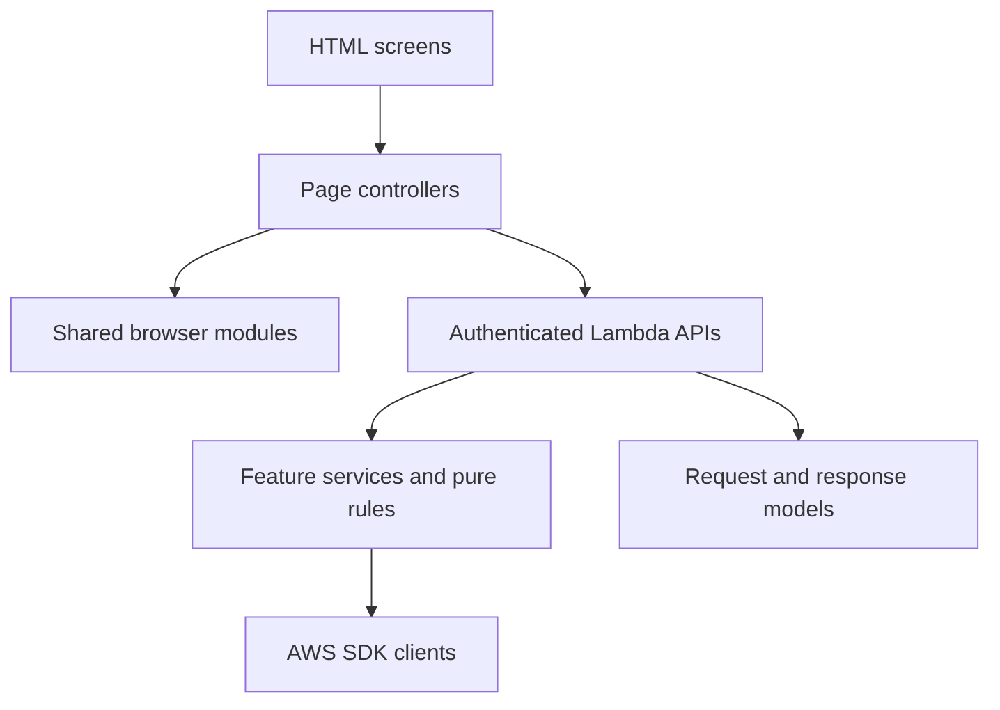

# Source responsibilities and dependency direction

## Purpose

This document describes the intended source boundaries and the refactoring completed in this change. Runtime behavior and existing API payloads remain the compatibility contract.

## Dependency direction

- Browser screens own markup and semantic structure. A page controller owns that screen's event wiring and view state.
- Shared browser modules contain deterministic transformations or cross-screen presentation behavior. They must not issue network requests unless their name and role make that responsibility explicit.
- Lambda handlers parse transport events through `LambdaRequestParser`, verify authorization, call feature logic, and shape API Gateway responses.
- Feature services own a single feature's validation and persistence work. Pure rules such as score deltas do not know about HTTP or AWS.
- DynamoDB and S3 access stays behind feature-specific services or repositories. `ScheduleRepository` owns schedule/facility table requests and `BasketballRepository` owns scorebook table access. A refactor must preserve table names, keys, and endpoint payloads unless an API migration is separately designed.

## Current feature boundaries

| Feature               | Browser entry point                                                                | Lambda entry point                                        | Extracted responsibility                                                                                                                                                                        |
| --------------------- | ---------------------------------------------------------------------------------- | --------------------------------------------------------- | ----------------------------------------------------------------------------------------------------------------------------------------------------------------------------------------------- |
| Schedule              | `static/app.js`, `static/calendar-view.js`, `static/schedule-detail-controller.js` | `ScheduleApi` → `ScheduleRepository`                      | `ScheduleApi` handles authentication, input validation, and response mapping; `ScheduleRepository` owns schedule and facility table requests. Browser modules render and edit schedule screens. |
| Calendar export       | `static/calendar-export.js`                                                        | Schedule API through shared authenticated browser helpers | Owns ICS generation and monthly share-text formatting.                                                                                                                                          |
| Announcements         | `static/announcement-controller.js`                                                | `ScheduleApi` → `AnnouncementService`                     | The browser controller owns announcement rendering and admin actions; the service validates and writes records.                                                                                 |
| Basketball scorebook  | `static/basketball.js`                                                             | `BasketballApi` → `BasketballRepository`                  | The API handles authorization, validation, and workflow decisions; the repository owns table access and query pagination. `BasketballStatistics` defines pure action-to-stat deltas.            |
| Calendar image import | `static/image-upload-controller.js`, `static/image-jobs.js`                        | `UploadApi`, `ImageProcessor`                             | The registration screen delegates file selection and direct S3 upload to a dedicated controller; job status, image extraction, and schedule persistence remain separate responsibilities.       |
| Facilities            | `static/register.js`                                                               | `FacilityApi`                                             | Facility CRUD remains isolated from schedule and scorebook behavior.                                                                                                                            |

## Naming rules

- Java types use nouns or noun phrases in `UpperCamelCase`; methods use clear verbs in `lowerCamelCase`; constants use `UPPER_SNAKE_CASE`.
- JavaScript functions use descriptive `lowerCamelCase` verbs. Keep selectors and DOM IDs aligned with the feature name.
- Prefer feature terms such as `AnnouncementService`, `BasketballStatistics`, and `parseMigrationCsv` over generic names such as `Helper`, `Manager`, or `Util`.
- Use a shared utility only when multiple callers need the same deterministic behavior. AWS access, authorization, and feature validation belong in explicitly named feature components.
- Write comments and Javadoc in Japanese. Keep identifiers in English. Document reasoning, constraints, and side effects rather than restating each line.

## Safe refactoring sequence

1. Preserve the current API route, authentication requirements, DynamoDB table/key shape, and browser-visible behavior.
2. Extract deterministic rules first and cover them with fast tests that need no network or AWS credentials.
3. Extract one feature's persistence behind a named service and keep the Lambda handler as a thin router.
4. Move browser code only when script order and global dependencies are understood; keep page initialization explicit.
5. Update the architecture, source inventory, authorization, screen-flow, and development documents when a boundary changes.
6. Run local tests and static checks. Never use a production AWS endpoint as a test target.

## Remaining decomposition opportunities

`BasketballApi` still coordinates multiple scorebook workflows. Table access now sits behind `BasketballRepository`; the next boundary is to separate team, game, and ranking workflows while keeping transaction, clock, undo, and legacy-record behavior covered by contract tests. `ScheduleApi` owns authentication, route dispatch, schedule mapping, and write workflows; direct table access now sits behind `ScheduleRepository`. The next boundary is to separate read and write workflows after tests cover schedule moves, facility enrichment, and legacy records. Browser authentication and shared state need browser-level contract tests before they are moved again.

## Cost boundary

Unit and static checks are local and make no AWS requests. Do not trigger CodePipeline, Lambda deployment, CloudFront invalidation, Gemini extraction, or paid external APIs as part of local refactoring verification.
