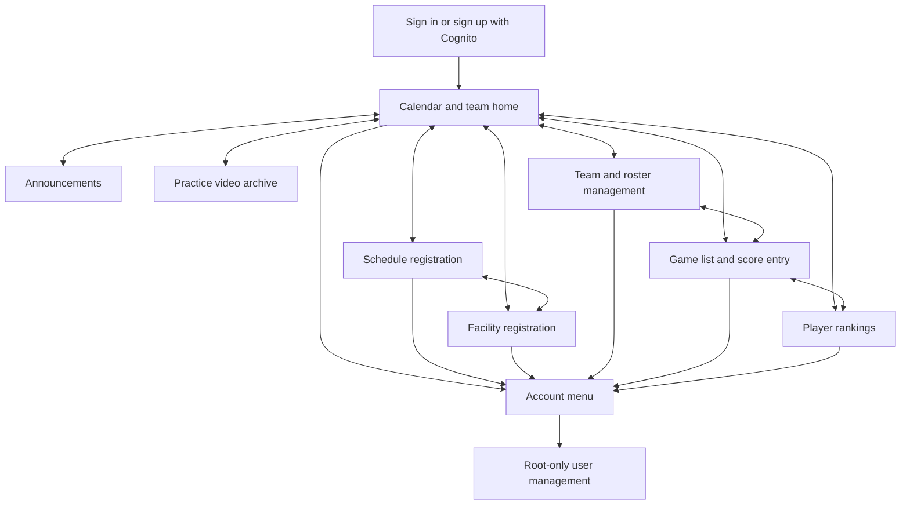

# Screen flow and navigation

The common navigation is present on the calendar, schedule registration, facility registration, and scorebook screens. On narrow displays the navigation scrolls horizontally. The active destination uses `aria-current="page"` and a visible highlight.

## Navigation behavior

- `index.html` anchors the navigation to the calendar, announcements, and video sections. Scrolling the page updates the highlighted section.
- `register.html?screen=schedule` shows manual and image-based schedule registration.
- `register.html?screen=facility` shows only the facility form.
- `basketball.html?view=teams`, `?view=games`, and `?view=rankings` select the corresponding scorebook area.
- Every top-level screen links to the other destinations through the same navigation bar.
- The account menu is available on every authenticated screen and contains the role label, account identifier, sign-out action, and guarded self-service account deletion.
- Root administrators also see the user-management destination, where they can promote, demote, disable, enable, or delete other accounts.

## Roles

Guests can read the calendar, visible announcements, facilities, team roster, completed game results, and rankings. Administrators can additionally create and edit schedules, facilities, announcements, teams, roster entries, and games, and record score actions. Root administrators inherit those rights and can manage accounts. The server checks the role on every protected request; hiding a form in the browser is not an authorization control.
